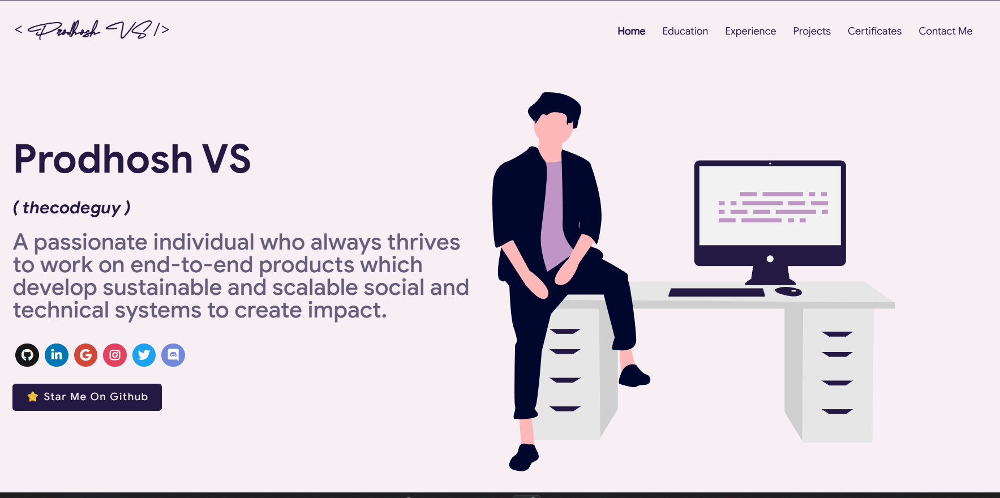

<p align="center">
  
</p>

<h1 align="center">Prodhosh VS</h1>

<p align="center">
  Full Stack Developer and AI Engineer &nbsp;|&nbsp; VIT Chennai &nbsp;|&nbsp; IIT Madras
</p>

<p align="center">
  <a href="https://prodhosh.me">
    
  </a>
  <a href="https://github.com/PRODHOSH/masterPortfolio">
    
  </a>
  <a href="https://reactjs.org/">
    
  </a>
  
</p>

<br />

<p align="center">
  <a href="https://prodhosh.me">
    
  </a>
</p>

<br />

This is my personal portfolio website where I showcase everything I have been building and contributing to. It covers my projects, open source work, experience, education, certifications, and resume all in one place. The site is fully responsive, supports dark and light themes, and all the data is driven through a single config file so updates are easy.

<br />

## What is inside

The portfolio has 7 pages:

| Page        | What you will find                                                                     |
| ----------- | -------------------------------------------------------------------------------------- |
| Home        | Introduction, skills, GitHub contribution calendar                                     |
| Experience  | Work, internships, clubs, open source communities                                      |
| Education   | VIT Chennai and IIT Madras degrees, certifications, badges                             |
| Projects    | Personal builds like FlashFetch, BS Prep, Nallamala House                              |
| Open Source | GitHub profile stats, PR and issue charts, latest pull requests with GSSoC/NSoC labels |
| Resume      | Inline PDF viewer                                                                      |
| Contact     | Email, location, and social links                                                      |

<br />

## Tech Stack

<p>
  
  
  
  
  
  
  
</p>

The charts in the Open Source page use Chart.js via `react-chartjs-2`. Animations are handled by `react-reveal`. SEO tags including Open Graph, Twitter Card, and structured data are rendered with `react-helmet`. GitHub stats on the Open Source page are fetched live from the GitHub REST API on page load.

<br />

## Running it locally

Make sure you have Node 18 or above installed.

```bash
git clone https://github.com/PRODHOSH/masterPortfolio.git
cd masterPortfolio
npm install
npm start
```

The site will open at `http://localhost:3000`. To build for production run `npm run build`.

<br />

## Updating your GitHub data

The Open Source page shows pull requests and issues fetched from your GitHub profile. This data lives in `src/shared/opensource/` as JSON files. To refresh it with your real GitHub data:

**Step 1** — copy the env file and fill it in

```bash
cp env.example .env
```

Open `.env` and set your values:

```
GITHUB_TOKEN=your_personal_access_token
GITHUB_USERNAME=PRODHOSH
```

You can generate a token at [github.com/settings/tokens](https://github.com/settings/tokens). Read access to public repos is enough.

**Step 2** — run the fetcher

```bash
node git_data_fetcher.mjs
```

This hits the GitHub GraphQL API and pulls your latest pull requests, issues, and organizations, then writes them directly into the JSON files. Run it whenever you want the page to reflect new activity.

<br />

## Customizing

All personal data lives in `src/portfolio.js`. You can update your name, bio, social links, education, experience, certifications, projects, and contact details there and the entire site updates automatically.

To change the theme open `src/theme.js` and switch the exported `chosenTheme` to any of the available options, or define your own color set.

Icons for skills and tech stack come from [Iconify](https://icon-sets.iconify.design/). Search for any icon, copy the identifier, and paste it into the `fontAwesomeClassname` field of the relevant skill.

<br />

## Deploying

The easiest way is Vercel or Netlify. Just connect your repo and it deploys on every push. For GitHub Pages, run `npm run build` and push the `build/` folder to your `gh-pages` branch.

Make sure to set `homepage` in `package.json` to your domain if you are hosting at a custom URL like `https://prodhosh.me`.

<br />

## SEO

The site has full Open Graph and Twitter Card support, a structured data schema (`Person` type), a sitemap at `/sitemap.xml`, and a `robots.txt` pointing crawlers to it. The canonical URL is set to `https://prodhosh.me` across all pages.

<br />

## Attribution

This portfolio was built on top of the [masterPortfolio](https://github.com/ashutosh1919/masterPortfolio) open source template by Ashutosh Hathidara. It has been heavily customized with a new Open Source page, GitHub live stats integration, PR label badges, SEO improvements, and all personal data replaced.

---

<p align="center">
  Made by <a href="https://prodhosh.me">Prodhosh VS</a> &nbsp;|&nbsp;
  <a href="https://github.com/PRODHOSH">@PRODHOSH</a> &nbsp;|&nbsp;
  <a href="https://www.linkedin.com/in/prodhoshvs/">LinkedIn</a>
</p>
