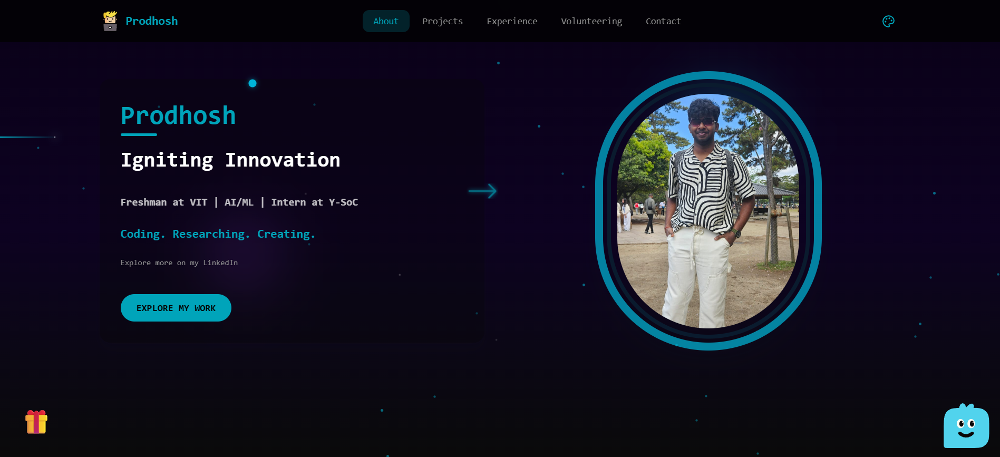

<div align="center">

# Prodhosh Portfolio

Clean, fast, and animated personal site built with Next.js 16 and Tailwind v4.


[Live](https://prodhosh.github.io/prodhosh-portfolio/) · [Issues](https://github.com/PRODHOSH/prodhosh-portfolio/issues) · [Contact](mailto:prodhosh3@gmail.com)

<br/>


</div>

---

## ⚡ Quick Start

```bash
# Clone & Install
git clone https://github.com/PRODHOSH/prodhosh-portfolio.git
cd prodhosh-portfolio
npm install

# Development
npm run dev

# Build
npm run build
```

---

## 🎯 About

<div align="center">


A **next-generation portfolio** featuring dual-theme backgrounds (Galaxy 🌌 & Cyberpunk City 🏙️), interactive animations, and an AI chatbot assistant.

</div>

---

## ✨ Features

<div align="center">

| Visual | Performance | Tech |
|:------:|:----------:|:----:|
| Dual Themes | Static Export | Next.js 16 |
| Smooth Animations | Turbopack | TypeScript |
| Interactive Modals | Lighthouse 95+ | Tailwind v4 |

</div>

<div align="center">


</div>

---

## 🐳 Docker

```bash
# Build image
docker build -t prodhosh-portfolio .

# Run container
docker run -d -p 3000:3000 prodhosh-portfolio

# Visit http://localhost:3000
```

---

## 📁 Project Structure

```
prodhosh-portfolio/
├── app/                 # Next.js app directory
│   ├── page.tsx         # Main portfolio
│   ├── layout.tsx       # Root layout
│   └── globals.css      # Styles & animations
├── components/          # React components
├── public/              # Static assets
├── Dockerfile           # Docker config
└── package.json         # Dependencies
```

---

## 🎨 Themes

<div align="center">

### 🌌 Galaxy & 🏙️ Cyberpunk
Pick your vibe: nebula skies or neon city.




</div>

---

## 🛠️ Deploy

```bash
# Build static export
npm run build

# Deploy to GitHub Pages
git subtree push --prefix out origin gh-pages
```

---

## 🚀 Tech Stack

<div align="center">


</div>

---

## 🤝 Connect

<div align="center">

**Connect:** [GitHub](https://github.com/PRODHOSH) · [LinkedIn](https://linkedin.com/in/prodhoshvs) · [Email](mailto:prodhosh3@gmail.com) · [Portfolio](https://prodhosh.github.io/prodhosh-portfolio/)

<br/>


</div>
